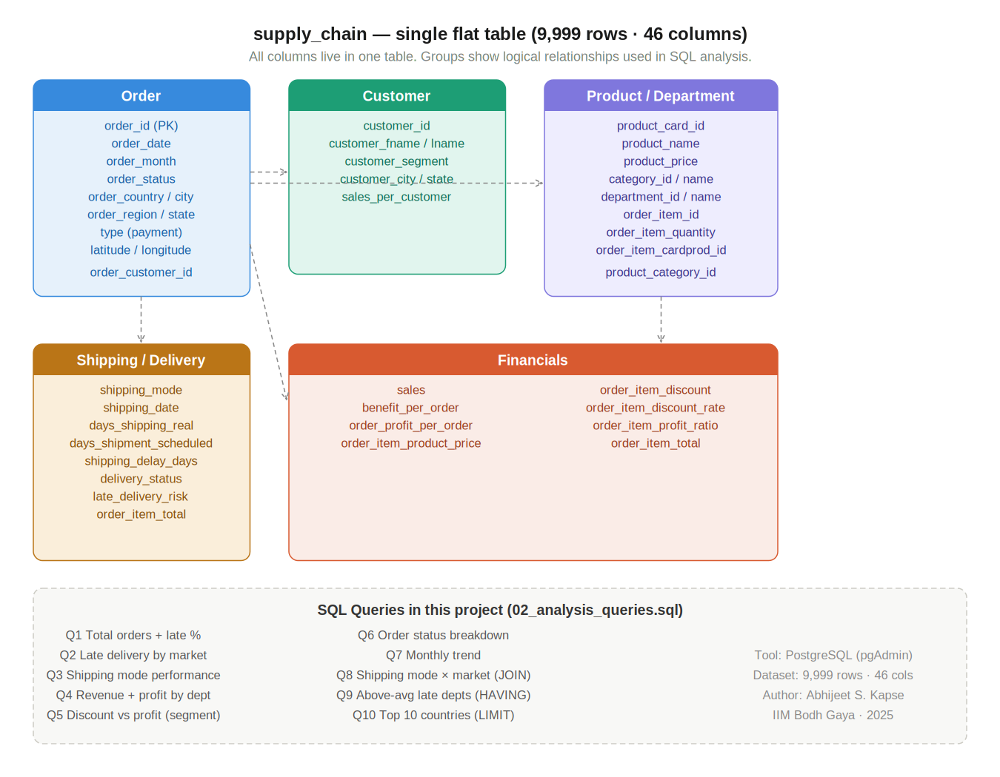

[sql_README.md](https://github.com/user-attachments/files/25979631/sql_README.md)
# SQL Analysis — Supply Chain Performance Dashboard

**Tool:** PostgreSQL (pgAdmin)  
**Dataset:** DataCo Supply Chain — 9,999 orders, 46 columns  
**Author:** Abhijeet S. Kapse | MBA - Hospital and Healthcare Management, IIM Bodh Gaya  

---

## How to Run

1. Open pgAdmin and create a new database
2. Run `01_create_table.sql` to create the table
3. Import the CSV via pgAdmin: right-click table → Import/Export → select CSV → skip header row
4. Run `02_analysis_queries.sql` — execute each query block individually

---

## Queries Covered

| # | Question | SQL Concepts Used |
|---|----------|-------------------|
| Q1 | Total orders vs late orders + late delivery % | SELECT, COUNT, SUM, ROUND |
| Q2 | Late delivery rate by market | GROUP BY, ORDER BY |
| Q3 | Shipping mode performance — avg delay + late % | GROUP BY, AVG |
| Q4 | Revenue and profit by department | SUM, AVG, GROUP BY |
| Q5 | Does higher discount = lower profit? By segment | AVG, GROUP BY |
| Q6 | Order status breakdown with revenue share | Subquery in SELECT |
| Q7 | Monthly order volume and revenue trend | GROUP BY month |
| Q8 | Shipping mode usage by market | JOIN with subquery |
| Q9 | Departments with above-average late delivery rate | HAVING with subquery |
| Q10 | Top 10 countries by order volume + avg delay | ORDER BY, LIMIT |

---

## Key Findings from SQL Analysis

- **53.7% overall late delivery rate** — more than half of all orders delayed
- **Europe** had the highest late delivery % among all markets
- **First Class** shipping had the worst on-time performance despite being a premium option
- **Higher discount rates** consistently correlated with lower profit margins across all 3 customer segments
- **Apparel and Fishing** were top departments by revenue
- Departments with above-average late delivery rates identified for targeted process improvement

---

## Files

| File | Description |
|------|-------------|
| `01_create_table.sql` | Table schema — run this first |
| `02_analysis_queries.sql` | 10 analytical queries with comments |

## Schema Overview

## Related Project Files

- [Excel Dashboard](../Supply_Chain_Dashboard_AK.xlsx)
- [Tableau Public Dashboard](https://public.tableau.com/app/profile/abhijit.k1907/viz/Supply_Chain_Tableau_AK/SupplychainDashboard)
